<div align="center">

# 🎬 Hangug Deulama

### 한국 드라마 — _Korean Drama_

A swipe-based K-Drama discovery platform with personalized, rule-based recommendations.

Built with **React 19**, **Tailwind CSS 4**, **PHP 8**, and **MySQL**.

[](https://react.dev)
[](https://vitejs.dev)
[](https://tailwindcss.com)
[](https://www.php.net)
[](https://www.mysql.com)
[](LICENSE)

**Academic Project** — developed for the **Software Development II** course.

</div>

---

## 📑 Table of Contents

- [🎬 Hangug Deulama](#-hangug-deulama)
    - [한국 드라마 — _Korean Drama_](#한국-드라마--korean-drama)
  - [📑 Table of Contents](#-table-of-contents)
  - [🧭 Overview](#-overview)
  - [📸 Screenshots](#-screenshots)
    - [🖥️ Website](#️-website)
    - [📱 Mobile App (Android)](#-mobile-app-android)
  - [✨ Features](#-features)
    - [Discovery](#discovery)
    - [Engagement](#engagement)
    - [Personalization](#personalization)
    - [Account \& UX](#account--ux)
    - [Engineering](#engineering)
  - [🛠️ Tech Stack](#️-tech-stack)
    - [Frontend](#frontend)
    - [Backend (separate PHP repo, reachable via `VITE_API_BASE_URL`)](#backend-separate-php-repo-reachable-via-vite_api_base_url)
    - [Tooling](#tooling)
  - [📂 Project Structure](#-project-structure)
  - [🚀 Quick Start](#-quick-start)
    - [Prerequisites](#prerequisites)
    - [1. Clone \& install](#1-clone--install)
    - [2. Configure environment](#2-configure-environment)
    - [3. Run the frontend](#3-run-the-frontend)
    - [4. Build for production](#4-build-for-production)
  - [🔀 Switching Between Local \& Production](#-switching-between-local--production)
    - [Verifying the switch](#verifying-the-switch)
  - [💻 Local Setup (XAMPP)](#-local-setup-xampp)
    - [1. Install XAMPP](#1-install-xampp)
    - [2. Mount the PHP backend](#2-mount-the-php-backend)
    - [3. Import the database](#3-import-the-database)
    - [4. Configure the frontend `.env`](#4-configure-the-frontend-env)
    - [5. Smoke test](#5-smoke-test)
  - [🌐 Production Setup](#-production-setup)
  - [🔐 Environment Variables](#-environment-variables)
  - [📡 API Surface](#-api-surface)
    - [Standard response envelope](#standard-response-envelope)
  - [🗄️ Database Schema](#️-database-schema)
  - [🧠 Recommendation Logic](#-recommendation-logic)
  - [🧠 State Management](#-state-management)
  - [📜 Scripts](#-scripts)
  - [🗺️ Roadmap](#️-roadmap)
  - [🎓 Academic Context](#-academic-context)
  - [📚 Additional Documentation](#-additional-documentation)
  - [👨‍💻 Author](#-author)
  - [📄 License](#-license)

---

## 🧭 Overview

With thousands of Korean dramas spread across multiple streaming platforms, viewers often spend more time searching than watching. **Hangug Deulama** flips that around — instead of asking the user to filter and search, the user simply swipes.

- **👉 Swipe right** to like a drama
- **👈 Swipe left** to skip it
- **❤️ Favorite, 🔖 Watch Later, ✅ Watched** actions build a rich preference profile
- **🎯 Personalized Top 10** recommendations, regenerated every time the swipe history changes

The application ships in two modes, sharing the same frontend — only `VITE_API_BASE_URL` changes:

| Mode           | Backend                          | Use case                            |
| -------------- | -------------------------------- | ----------------------------------- |
| **Local**      | PHP/MySQL via XAMPP              | Academic demos, mentor walkthroughs |
| **Production** | `https://api.appriyo.com/hangug` | Live deployed demo                  |

---

## 📸 Screenshots

> Replace the placeholders below with real captures — drop your image files into `docs/screenshots/web/` and `docs/screenshots/mobile/` and update the paths. Keep filenames descriptive (`home.png`, `discover-swipe.png`, `recommendations.png`, etc.) so the table stays easy to maintain.

### 🖥️ Website

<div align="center">

|                                      Home                                       |                                      Discover (Swipe)                                       |                                       Drama Details                                       |
| :-----------------------------------------------------------------------------: | :-----------------------------------------------------------------------------------------: | :---------------------------------------------------------------------------------------: |
| 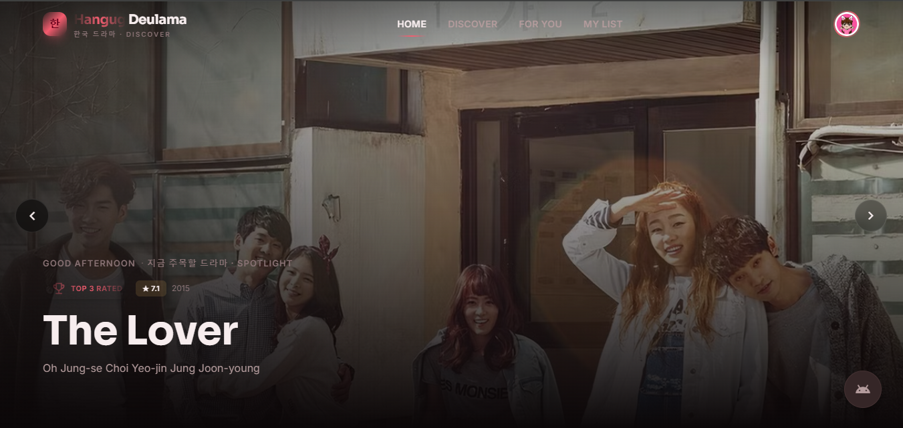 | 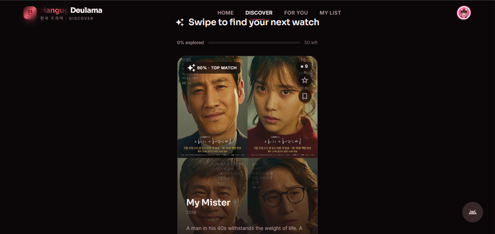 | 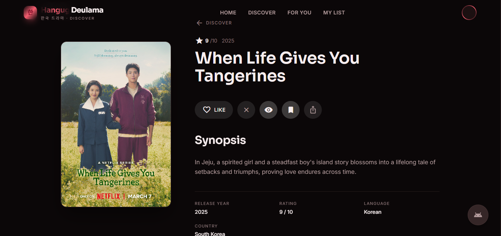 |

|                                            Recommendations                                            |                                       Profile                                       |                                         Activity                                          |
| :---------------------------------------------------------------------------------------------------: | :---------------------------------------------------------------------------------: | :---------------------------------------------------------------------------------------: |
| 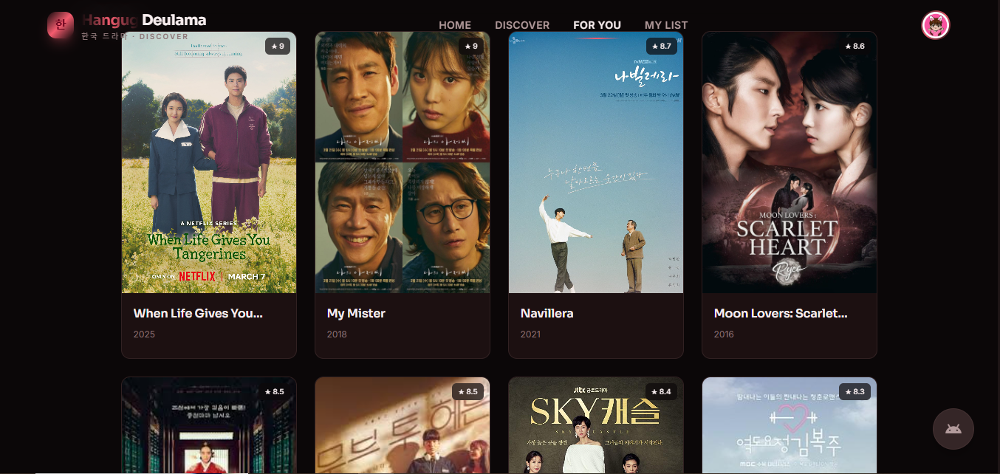 | 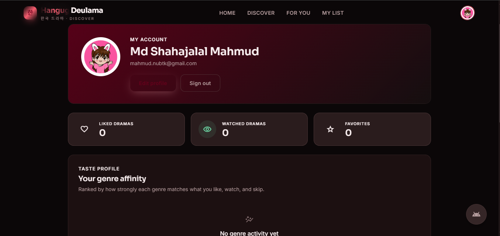 | 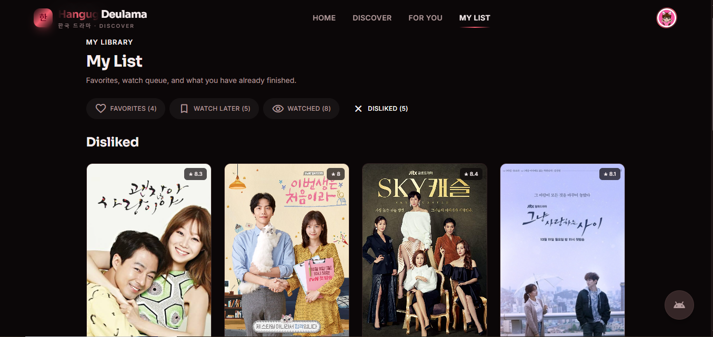 |

|                                    Top Picks For you                                     |                                      login                                      |                                       Register                                        |
| :--------------------------------------------------------------------------------------: | :-----------------------------------------------------------------------------: | :-----------------------------------------------------------------------------------: |
| 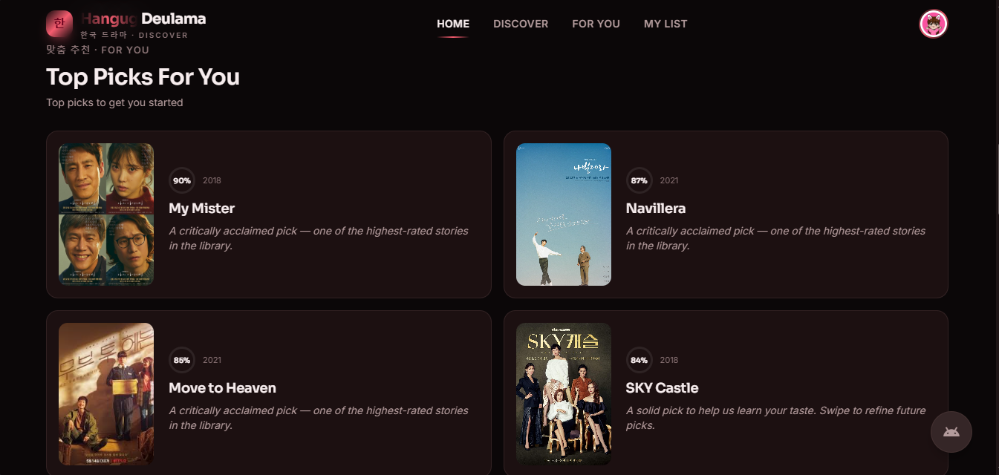 | 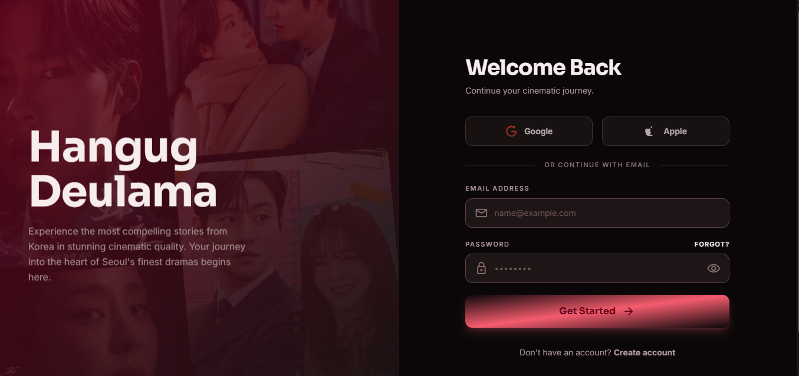 | 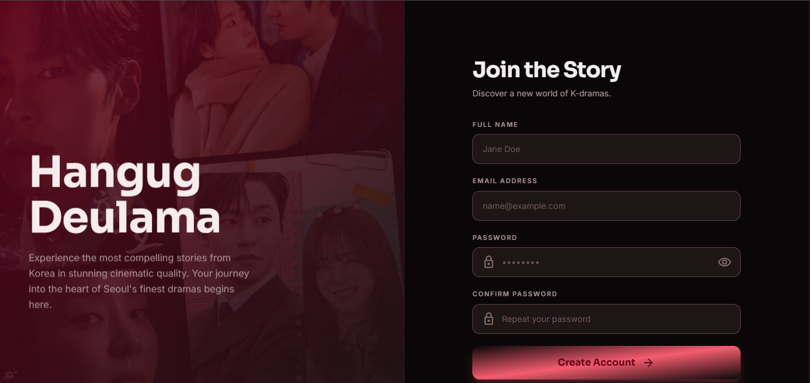 |

</div>

### 📱 Mobile App (Android)

<div align="center">

|                                         Home                                          |                                      Swipe Deck                                       |                                           Recommendations                                            |
| :-----------------------------------------------------------------------------------: | :-----------------------------------------------------------------------------------: | :--------------------------------------------------------------------------------------------------: |
| 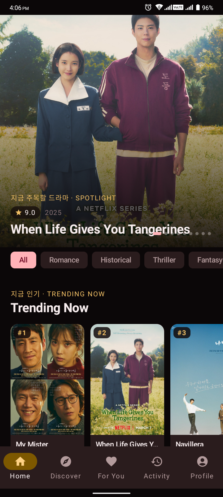 | 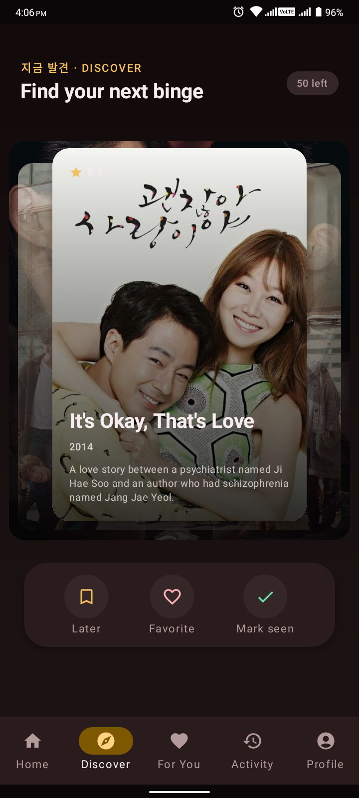 | 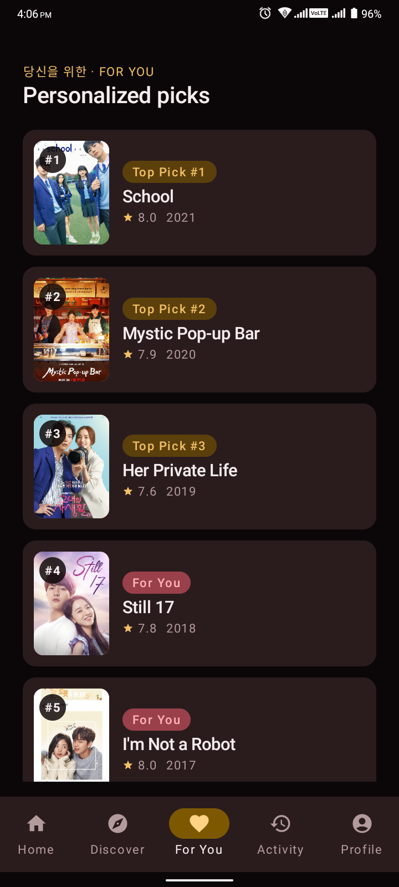 |

|                                       Drama Details                                        |                                       Profile                                        |                                           activity                                            |
| :----------------------------------------------------------------------------------------: | :----------------------------------------------------------------------------------: | :-------------------------------------------------------------------------------------------: |
| 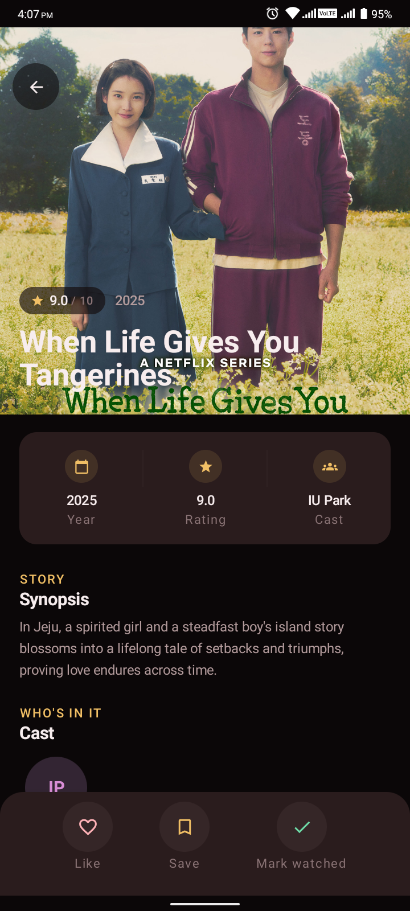 | 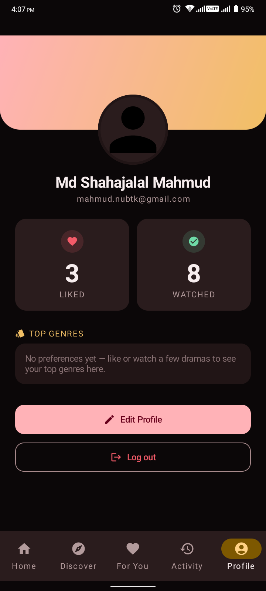 | 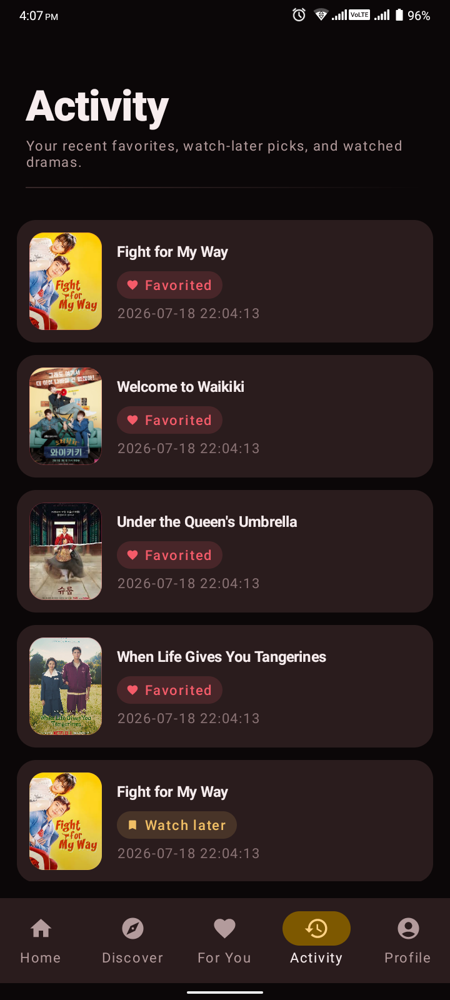 |

|                                        Top Picks For you                                        |                                         login                                          |                                          Register                                           |
| :---------------------------------------------------------------------------------------------: | :------------------------------------------------------------------------------------: | :-----------------------------------------------------------------------------------------: |
| 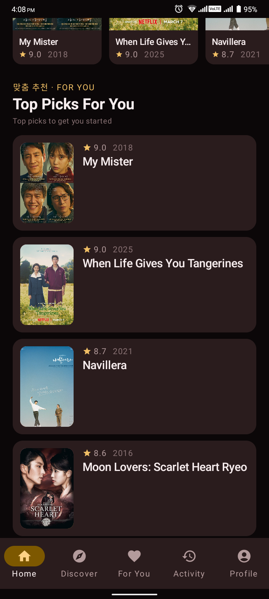 | 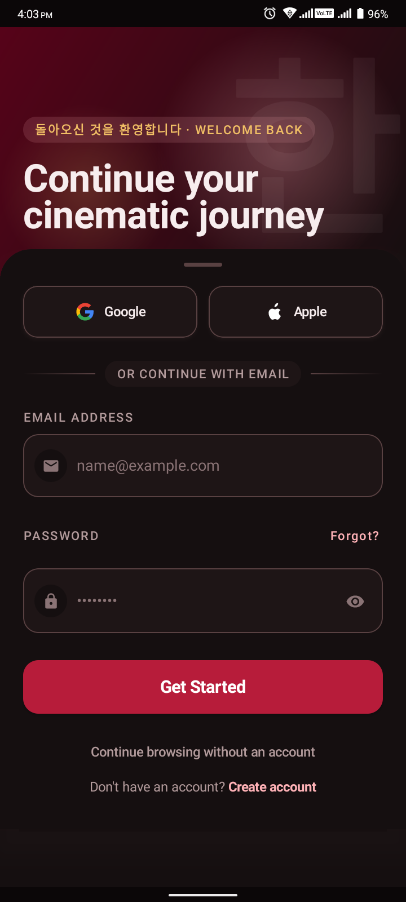 | 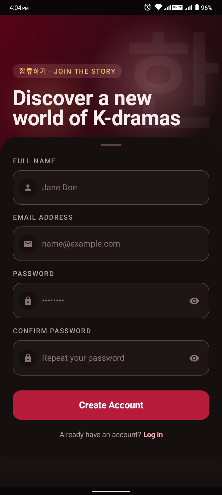 |

</div>

---

## ✨ Features

### Discovery

- 🎭 Curated catalog of K-Dramas with banner art and posters
- 👉 Swipe deck powered by gesture + keyboard controls
- 🔎 Search, category tabs, and genre filtering on the Discover screen
- 🔥 Trending rail, genre pills, Continue Watching, and Spotlight on Home
- 📊 Match-score badge for recommended titles

### Engagement

- ❤️ **Favorites** — pin dramas you love
- 🔖 **Watch Later** — bookmark something for later
- ✅ **Watched** — log what you've completed (write-once, no removal)
- 🎬 Detailed drama pages with cast, synopsis, info grid, and similar titles
- ⚡ Activity timeline of every swipe, like, and list change

### Personalization

- 🧠 Rule-based recommendation engine combining likes, dislikes, favorites, and watch history
- 🎯 Personalized Top 10 recommendations screen
- 📈 Genre statistics showing your taste profile
- 🚪 Anonymous-mode support — swipe without an account, sync on registration

### Account & UX

- 🔐 JWT-based registration and login with `localStorage` persistence
- 👤 Editable profile (name + avatar upload) via modal
- 🛡️ Protected routes for `Profile` and `Activity`
- 🪪 Global 401 listener — expired tokens automatically sign the user out
- 📱 Fully responsive layout with a custom bottom-nav for mobile
- 🌗 Cinema-inspired UI (Sora / Inter / Material Symbols)

### Engineering

- 🧱 Centralized Axios client with interceptors and a normalized error envelope
- 🧩 Component-grouped architecture (`layout`, `home`, `discover`, `details`, `drama`, `profile`, `auth`, `ui`)
- 🎣 Custom hooks (`useScrollReveal`)
- 🧠 Two React Contexts: `AuthContext` and `DramaContext`
- ⚡ Vite 8 + Tailwind 4 (Vite plugin) for instant dev builds
- ✅ ESLint with React Hooks + React Refresh rules

---

## 🛠️ Tech Stack

### Frontend

| Layer         | Library / Tool               | Version |
| ------------- | ---------------------------- | ------- |
| UI Framework  | React                        | 19.x    |
| Bundler       | Vite                         | 8.x     |
| Styling       | Tailwind CSS (+ Vite plugin) | 4.x     |
| Component lib | daisyUI                      | 5.x     |
| Routing       | React Router DOM             | 7.x     |
| HTTP          | Axios                        | 1.x     |
| Utility       | clsx                         | 2.x     |
| Linting       | ESLint + react-hooks plugin  | 10.x    |

### Backend (separate PHP repo, reachable via `VITE_API_BASE_URL`)

- **PHP 8** (vanilla, JSON REST API)
- **JWT (HS256)** for stateless authentication
- **MySQL / MariaDB** relational database via PDO (utf8mb4)
- **Apache `mod_rewrite`** front controller (`public/index.php → App\Core\Router`)

### Tooling

- Visual Studio Code
- XAMPP / Laragon / MAMP (local PHP / MySQL stack)
- Postman (API testing)
- Git + GitHub

---

## 📂 Project Structure

This repository contains the **frontend** only. The PHP backend is a separate codebase, deployed to `api.appriyo.com/hangug` for production and to `localhost/hangug-api/public` for local XAMPP.

```text
Hangug-Deulama/
├── docs/
│   ├── api.md                     # Full REST API reference
│   ├── DATABASE_DESIGN.md         # ERD + table specs
│   ├── DESING.md                  # UI / design system
│   ├── MOBILE_DESIGN.md           # Mobile-app design system
│   └── screenshots/
│       ├── web/                   # Website screenshots
│       └── mobile/                # Android app screenshots
│
├── public/
│   └── favicon.svg
│
├── src/
│   ├── api/                       # Axios client + per-resource modules
│   │   ├── client.js              # Interceptors, error normalization, 401 bus
│   │   ├── config.js              # baseURL, storage keys
│   │   ├── auth.js
│   │   ├── dramas.js
│   │   ├── favorites.js
│   │   ├── watchLater.js
│   │   ├── watched.js
│   │   ├── swipe.js
│   │   ├── recommendations.js
│   │   ├── profile.js
│   │   ├── health.js
│   │   └── index.js               # Barrel export
│   │
│   ├── assets/
│   │
│   ├── components/
│   │   ├── auth/                  # AuthHero, AuthCard, AuthInput, BrandSection…
│   │   ├── layout/                # Navbar, BottomNav, Footer, ProfileMenu,
│   │   │                          # SearchBar, ProtectedRoute, FloatingDownloadButton
│   │   ├── home/                  # HeroSection, GenrePills, GenreRow,
│   │   │                          # TrendingSection, SpotlightRail,
│   │   │                          # RecommendationSection, AllDramaSection
│   │   ├── discover/              # DiscoverHero, DiscoverFilters,
│   │   │                          # SwipeDeck, SwipeCard, ActionButtons,
│   │   │                          # RecommendationBadge, SwipeProgress, KeyboardHints
│   │   ├── details/               # BackdropHero, DetailsHeader, PosterPanel,
│   │   │                          # ActionBar, SynopsisSection, InfoGrid,
│   │   │                          # CastCard, CastSection, SimilarDramas, DetailsSkeleton
│   │   ├── drama/                 # DramaCard, DramaPosterCard, LandscapeDramaCard
│   │   ├── profile/                # ProfileHero, ProfileEditModal,
│   │   │                          # StatCard, TasteProfile, ProfileSkeleton
│   │   └── ui/                    # Button, EmptyState, ErrorState, LoadingState,
│   │                              # GenreBadge, ImageWithSkeleton, RevealSection,
│   │                              # SectionHeader, SkeletonCard, MatchRing, Avatar
│   │
│   ├── context/
│   │   ├── AuthContext.jsx        # JWT session state + auto-login + global 401 listener
│   │   └── DramaContext.jsx       # Catalog + favorites/watch-later/watched + swipes
│   │
│   ├── data/
│   │   └── dramas.json            # Static fallback seed (not used by API mode)
│   │
│   ├── hooks/
│   │   └── useScrollReveal.js
│   │
│   ├── layouts/
│   │   └── MainLayout.jsx
│   │
│   ├── pages/
│   │   ├── Home.jsx
│   │   ├── Discover.jsx
│   │   ├── Recommendations.jsx
│   │   ├── Activity.jsx
│   │   ├── DramaDetails.jsx
│   │   ├── Login.jsx
│   │   ├── Register.jsx
│   │   └── Profile.jsx
│   │
│   ├── routes/
│   │   └── index.jsx              # createBrowserRouter + ProtectedRoute
│   │
│   ├── utils/
│   │   ├── dramaHelpers.js
│   │   ├── avatar.js
│   │   └── formErrors.js
│   │
│   ├── App.jsx                    # Provider tree: Auth → Drama → Router
│   ├── main.jsx                   # createRoot + StrictMode
│   └── index.css                  # Tailwind + custom theme tokens
│
├── .env.example                   # Documented env presets (LOCAL + PRODUCTION)
├── .gitignore
├── eslint.config.js
├── index.html
├── package.json
├── package-lock.json
├── vite.config.js                 # base: '/deulama/'
├── PROJECT.md                     # Full SRS / academic documentation
├── LICENSE                        # MIT License
└── README.md                      # You are here
```

---

## 🚀 Quick Start

### Prerequisites

- **Node.js** 18+ and **npm**
- A reachable PHP / MySQL backend, either:
  - **Local** — XAMPP / Laragon / MAMP with the backend mounted at `http://localhost/hangug-api/public`
  - **Production** — `https://api.appriyo.com/hangug` (already running)

### 1. Clone & install

```bash
git clone https://github.com/shahjalal-mahmud/Hangug-Deulama.git
cd Hangug-Deulama
npm install
```

### 2. Configure environment

```bash
cp .env.example .env
```

Edit `.env` and choose **ONE** of the two backend targets (see [🔀 Switching Between Local & Production](#-switching-between-local--production)):

```env
# Local XAMPP
VITE_API_BASE_URL=http://localhost/hangug-api/public

# Production (default)
# VITE_API_BASE_URL=https://api.appriyo.com/hangug
```

### 3. Run the frontend

```bash
npm run dev
```

Vite prints a local URL (usually `http://localhost:5173`). The Axios client automatically appends `/api` to the configured base URL, so requests go directly to `VITE_API_BASE_URL` — no dev proxy needed.

### 4. Build for production

```bash
npm run build
npm run preview      # smoke-test the production build locally
```

The build is emitted to `dist/` and assumes the app will be served from a sub-path (`/deulama/`) — see `vite.config.js` (`base: '/deulama/'`).

---

## 🔀 Switching Between Local & Production

The frontend is **environment-agnostic**. You only need to change `VITE_API_BASE_URL` in `.env`:

| Scenario                            | `VITE_API_BASE_URL`                   | When to use it                            |
| ----------------------------------- | ------------------------------------- | ----------------------------------------- |
| **LOCAL** — mentor demo on XAMPP    | `http://localhost/hangug-api/public`  | Backend on your machine via XAMPP/Laragon |
| **PRODUCTION** — deployed demo      | `https://api.appriyo.com/hangug`      | Live backend hosted on shared hosting     |
| **SAME-ORIGIN** — PHP & SPA on host | _(blank)_ → requests go to `/api/...` | When both frontend and API share one host |

After editing `.env`, **restart** `npm run dev` so Vite re-injects the variable.

The Axios client in `src/api/client.js` reads `VITE_API_BASE_URL` via `src/api/config.js` and appends `/api` automatically — for example, with the production value, every call ends up at `https://api.appriyo.com/hangug/api/...`.

### Verifying the switch

```bash
# With LOCAL value
curl http://localhost/hangug-api/public/api/health

# With PRODUCTION value
curl https://api.appriyo.com/hangug/api/health
```

Both should return the standard `{ "success": true, "message": "...", "data": {...} }` envelope.

---

## 💻 Local Setup (XAMPP)

For the **mentor walkthrough / academic demo**, run the full stack on your machine.

### 1. Install XAMPP

Download and install [XAMPP](https://www.apachefriends.org/). Start **Apache** and **MySQL** from the XAMPP control panel.

### 2. Mount the PHP backend

Place the backend project in:

```text
C:\xampp\htdocs\hangug-api\
```

…so that `public/index.php` is reachable at:

```text
http://localhost/hangug-api/public/
```

### 3. Import the database

1. Open `http://localhost/phpmyadmin`.
2. Create a database (e.g. `hangug_deulama`).
3. Import the SQL schema shipped with the backend (mirrored in [`docs/DATABASE_DESIGN.md`](docs/DATABASE_DESIGN.md)).
4. Update the backend's DB credentials in its `.env` / `config/database.php`.

### 4. Configure the frontend `.env`

```env
VITE_API_BASE_URL=http://localhost/hangug-api/public
```

### 5. Smoke test

```bash
curl http://localhost/hangug-api/public/api/health
curl http://localhost:5173     # Vite dev URL
```

The Vite frontend will talk to your local PHP API. Authenticated requests automatically carry the JWT stored in `localStorage` under `hd_jwt`.

> **Troubleshooting** — common pitfalls: `mod_rewrite` not enabled, port 80 conflicts (Skype / IIS), CORS preflight if Apache serves on a different port, and PHP not in PATH. Each is covered inline in the backend README.

---

## 🌐 Production Setup

The frontend is deployed separately from the backend.

| Layer       | URL                              | Notes                                   |
| ----------- | -------------------------------- | --------------------------------------- |
| Frontend    | `https://appriyo.com/deulama/`   | Static `dist/` served by shared hosting |
| Backend API | `https://api.appriyo.com/hangug` | PHP API at `VITE_API_BASE_URL`          |

`.env` ships pointing at the production API:

```env
VITE_API_BASE_URL=https://api.appriyo.com/hangug
```

To rebuild and redeploy the frontend:

```bash
npm run build
# upload contents of dist/ to your hosting root under /deulama/
```

`vite.config.js` is configured with `base: '/deulama/'` so assets, fonts, and route prefixes all work correctly under that sub-path.

---

## 🔐 Environment Variables

| Variable            | Description                                                                                   | Local example                        | Production example               |
| ------------------- | --------------------------------------------------------------------------------------------- | ------------------------------------ | -------------------------------- |
| `VITE_API_BASE_URL` | Base URL of the PHP backend. Leave blank for same-origin (API at `/api/...` on current host). | `http://localhost/hangug-api/public` | `https://api.appriyo.com/hangug` |

The JWT token and user payload are persisted to `localStorage` under keys defined in [`src/api/config.js`](src/api/config.js):

| Key                  | Purpose                                |
| -------------------- | -------------------------------------- |
| `hd_jwt`             | Bearer token                           |
| `hd_user`            | Cached user payload (id, name, email…) |
| `hd_liked_dramas`    | Liked drama IDs (anonymous mode)       |
| `hd_disliked_dramas` | Disliked drama IDs (anonymous mode)    |

---

## 📡 API Surface

The frontend consumes a JSON REST API documented in detail in [`docs/api.md`](docs/api.md). Quick reference — full base URL is `${VITE_API_BASE_URL}/api`:

| Method | Endpoint                        | Purpose                            | Auth |
| ------ | ------------------------------- | ---------------------------------- | :--: |
| GET    | `/api/health`                   | Liveness check                     |  No  |
| POST   | `/api/auth/register`            | Create an account (returns JWT)    |  No  |
| POST   | `/api/auth/login`               | Obtain a JWT                       |  No  |
| GET    | `/api/me`                       | Validate token / fetch self        | Yes  |
| GET    | `/api/dramas`                   | Browse the catalog (paged/sorted)  |  No  |
| GET    | `/api/dramas/{id}`              | Drama details                      |  No  |
| POST   | `/api/swipe`                    | Record like / dislike              | Yes  |
| POST   | `/api/favorites`                | Add favorite                       | Yes  |
| DELETE | `/api/favorites/{drama_id}`     | Remove favorite                    | Yes  |
| GET    | `/api/favorites`                | List favorites                     | Yes  |
| POST   | `/api/watch-later`              | Add to Watch Later                 | Yes  |
| DELETE | `/api/watch-later/{drama_id}`   | Remove from Watch Later            | Yes  |
| GET    | `/api/watch-later`              | List Watch Later                   | Yes  |
| POST   | `/api/watched`                  | Mark as watched                    | Yes  |
| GET    | `/api/watched`                  | List watched                       | Yes  |
| GET    | `/api/profile`                  | Get profile                        | Yes  |
| PUT    | `/api/profile`                  | Update profile (JSON or multipart) | Yes  |
| GET    | `/api/profile/genre-statistics` | Taste profile                      | Yes  |
| GET    | `/api/recommendations`          | Personalized Top 10                | Yes  |

The Axios client automatically attaches `Authorization: Bearer <token>` and centralizes error normalization — see [`src/api/client.js`](src/api/client.js).

### Standard response envelope

```json
// Success
{ "success": true, "message": "Operation completed successfully.", "data": {} }

// Error
{ "success": false, "message": "Validation failed.", "errors": {} }
```

---

## 🗄️ Database Schema

Full diagram and rationale live in [`docs/DATABASE_DESIGN.md`](docs/DATABASE_DESIGN.md). High-level tables:

| Table              | Key columns                                                                                     |
| ------------------ | ----------------------------------------------------------------------------------------------- |
| `users`            | `user_id`, `full_name`, `email`, `password_hash`, `avatar_url`, `created_at`                    |
| `dramas`           | `drama_id`, `title`, `storyline`, `genre`, `rating`, `release_year`, `poster_url`, `banner_url` |
| `swipes`           | `swipe_id`, `user_id`, `drama_id`, `swipe_type` (like / dislike), `created_at`                  |
| `favorites`        | `favorite_id`, `user_id`, `drama_id`, `created_at`                                              |
| `watch_later`      | `watch_later_id`, `user_id`, `drama_id`, `created_at`                                           |
| `watched`          | `watched_id`, `user_id`, `drama_id`, `watched_at`                                               |
| `user_preferences` | `preference_id`, `user_id`, `genre`, `preference_score`                                         |

---

## 🧠 Recommendation Logic

The backend (`GET /api/recommendations`) blends the following signals into a single score per candidate drama:

- **Liked dramas** — strong positive weight on shared genres
- **Disliked dramas** — negative weight (excluded if dominant)
- **Favorites** — boost for dramas similar to favorited ones
- **Watch Later** — light boost; indicates intent
- **Watched** — excluded from future suggestions
- **Genre preference score** — derived from cumulative likes/swipes
- **User interaction history** — recent activity weighted higher

The result is a personalized **Top 10** list that avoids content the user has already finished or consistently skipped. Cold-start users get the highest-rated dramas as a fallback (`is_personalized: false`, `fallback: true`).

---

## 🧠 State Management

The app uses two React Contexts layered in [`src/App.jsx`](src/App.jsx):

```text
<AuthProvider>       ← JWT session, login/register/logout, 401 listener
  └─ <DramaProvider>  ← catalog, favorites, watch-later, watched, swipe mutations
      └─ <RouterProvider>
```

- **AuthContext** — token + user + `bootstrapped` flag + global 401 listener that auto-signs-out on expired tokens.
- **DramaContext** — fetches the catalog, hydrates user libraries on login, applies **optimistic updates** for swipes / favorites / watch-later, and gracefully falls back to `localStorage` for anonymous use.

Liked and disliked drama IDs are mirrored in `localStorage` so anonymous users keep a consistent experience across reloads.

---

## 📜 Scripts

```bash
npm run dev        # Start Vite dev server  (http://localhost:5173)
npm run build      # Production build → dist/
npm run preview    # Preview the production build locally
npm run lint       # ESLint over the whole project
```

---

## 🗺️ Roadmap

The current build covers the full vertical slice: discovery → swipe → library → recommendations → account. Planned follow-ups:

- 🧠 ML-based recommendations (collaborative filtering on swipe data)
- 🔍 Full-text search with fuzzy matching
- 🎚️ Advanced filtering (year, rating, network, country)
- ⭐ User ratings & reviews
- 🔥 Trending / Popular this week feed
- 🌑 Dark mode toggle
- 🌐 Multi-language support (English / বাংলা / 한국어)
- 📺 Direct deep-links to streaming platforms

---

## 🎓 Academic Context

This project was developed for the **Software Development II** course to demonstrate:

- Full-stack web application architecture
- RESTful API design & JSON contracts
- Relational database modeling
- User interaction tracking & personalization
- Modern frontend engineering (hooks, context, optimistic UI)
- Responsive UI / UX design principles

Full SRS lives in [`PROJECT.md`](PROJECT.md), with supplementary design & database docs in [`docs/`](docs/).

---

## 📚 Additional Documentation

| Document                                             | Purpose                                  |
| ---------------------------------------------------- | ---------------------------------------- |
| [`PROJECT.md`](PROJECT.md)                           | Full SRS-level project documentation     |
| [`docs/api.md`](docs/api.md)                         | REST API reference (19 endpoints)        |
| [`docs/DATABASE_DESIGN.md`](docs/DATABASE_DESIGN.md) | Database schema + ER relationships       |
| [`docs/DESING.md`](docs/DESING.md)                   | Web design system & screen specification |
| [`docs/MOBILE_DESIGN.md`](docs/MOBILE_DESIGN.md)     | Mobile design system                     |

---

## 👨‍💻 Author

**Md. Shahajalal Mahmud**
Full Stack Developer · Android Developer · Software Engineering Student

[](https://github.com/shahjalal-mahmud)

---

## 📄 License

This project is licensed under the **MIT License** — see [`LICENSE`](LICENSE) for details.

It was created for educational and academic purposes as part of the Software Development II coursework.
